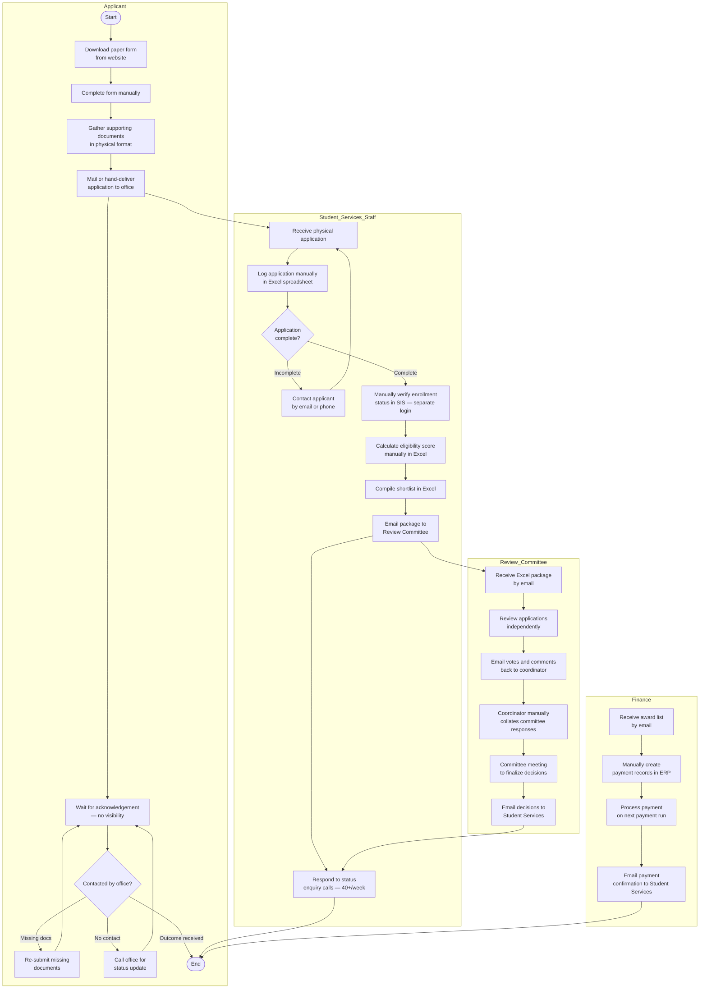

# Current State (As-Is) Process Map
## Manual Scholarship Application Process

> **Rendered automatically by GitHub.** This diagram uses Mermaid syntax and renders as a visual swimlane diagram on GitHub.

---

## Process Overview

**Process Name:** Scholarship Application — Current State (Manual)  
**Process Owner:** Director, Student Services  
**Analyst:** Albert Ibe, CBAP  
**Date Documented:** April 2026  
**Status:** As-Is (Pre-transformation)

**Key Metrics — Current State:**
- Average end-to-end processing time: **42 business days**
- Manual touchpoints: **18**
- Error rate (incomplete / incorrect applications): **24%**
- Staff effort per application: **3.5 hours**
- Weekly status enquiry calls handled manually: **40+**

---

## Swimlane Process Diagram

---

## Key Pain Points Identified

| # | Pain Point | Impact |
|---|---|---|
| 1 | No online submission — applicants must physically deliver documents | Excludes remote and international applicants; high friction |
| 2 | No applicant portal — zero visibility into application status | 40+ weekly status calls consuming 2 FTE hours/week |
| 3 | Manual enrollment verification — separate SIS login required | 20 min per application; high error risk |
| 4 | Manual scoring in Excel — no standardized formula enforcement | 24% error rate in eligibility scoring |
| 5 | Committee review by email — no audit trail or version control | Decisions not traceable; compliance risk |
| 6 | Manual ERP data entry for payments — double entry of award data | Rework risk; payment delays |
| 7 | No automated notifications — staff must manually contact applicants | Resource-intensive; inconsistent applicant experience |

---

*Next: See [future-state-process.md](future-state-process.md) for the To-Be process design.*
