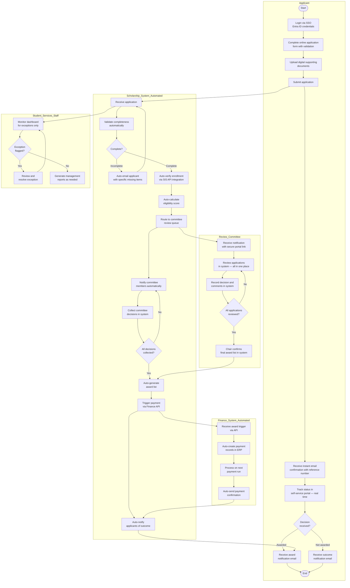

# Future State (To-Be) Process Map
## Automated Scholarship Application Process

> **Rendered automatically by GitHub.** This diagram uses Mermaid syntax and renders as a visual swimlane diagram on GitHub.

---

## Process Overview

**Process Name:** Scholarship Application — Future State (Automated)  
**Process Owner:** Director, Student Services  
**Analyst:** Albert Ibe, CBAP  
**Date Documented:** April 2026  
**Status:** To-Be (Post-transformation target)

**Key Metrics — Future State Targets:**
- Average end-to-end processing time: **10 business days** (↓ from 42)
- Manual touchpoints: **4** (↓ from 18)
- Error rate: **<3%** (↓ from 24%)
- Staff effort per application: **0.5 hours** (↓ from 3.5 hours)
- Weekly status enquiry calls: **<5** (↓ from 40+)

---

## Future State Swimlane Diagram

---

## Process Improvements Summary

| Dimension | Current State | Future State | Improvement |
|---|---|---|---|
| End-to-end processing time | 42 business days | 10 business days | **↓ 76%** |
| Manual touchpoints | 18 | 4 | **↓ 78%** |
| Application error rate | 24% | <3% | **↓ 88%** |
| Staff effort per application | 3.5 hours | 0.5 hours | **↓ 86%** |
| Weekly status calls | 40+ | <5 | **↓ 88%** |
| Audit trail availability | None | 100% | **New capability** |
| Applicant self-service | None | Full portal | **New capability** |
| SIS integration | Manual (separate login) | Automated API | **Eliminated manual step** |
| Finance integration | Manual data entry | Automated API trigger | **Eliminated double-entry** |

---

## Design Principles Applied

1. **Automate the routine, empower the exception** — Staff focus only on cases requiring human judgement
2. **Single source of truth** — All application data in one system; no spreadsheets or email chains
3. **Applicant-centric design** — Full self-service visibility eliminates information asymmetry
4. **Integration over re-entry** — Every system-to-system touchpoint automated via API
5. **Audit by design** — Every action timestamped and attributed to a named user from day one

---

*Related: See [business-requirements-doc.md](../requirements/business-requirements-doc.md) for full requirements tracing.*
